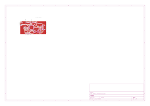

# usb3-multiport-hub

An open-source USB 3.2 Gen 2 (10 Gbps) multiport hub & docking station — designed in KiCad 9.



## Overview

A compact (93 × 69 mm), 6-layer PCB that combines a high-speed USB hub, video output, and a card reader into a single board. Powered by a 12V DC input with an onboard 20A buck converter.

### Features

| Feature | Details |
|---|---|
| **Hub IC** | Microchip USB7216CT — USB 3.2 Gen 2 SmartHub, 10 Gbps |
| **Upstream** | USB Type-C with HD3SS3220 CC controller & 10G mux |
| **Downstream Port 1** | USB Type-C (10 Gbps + USB 2.0) |
| **Downstream Port 2** | USB 3.0 Type-A (10 Gbps + USB 2.0) |
| **SD Card Reader** | MicroSD/TF via Genesys Logic GL3224 |
| **HDMI Output** | USB 3.0 → HDMI via MacroSilicon MS9132 + 64Mbit SPI Flash |
| **Power Input** | 12V DC barrel jack (5.5 × 2.1 mm) |
| **ESD Protection** | TI TPD4E05U06 & TPD4E02B04 on all external ports |
| **PCB** | 6-layer, 93 × 69 mm, controlled impedance (90Ω USB, 100Ω HDMI) |

## Block Diagram

```
                    ┌──────────────────────────────────────┐
                    │         Microchip USB7216CT          │
  USB-C ─── HD3SS3220 ──▶ Upstream                        │
  (10G Mux)         │                                      │
                    │   Port 1 ──▶ USB-C Downstream        │
                    │   Port 2 ──▶ USB-A 3.0 Downstream    │
                    │   Port 3 ──▶ GL3224 ──▶ MicroSD Slot │
                    │   Port 4 ──▶ MS9132 ──▶ HDMI Output  │
                    └──────────────────────────────────────┘

  12V DC ──▶ TPS53353 (20A Buck) ──▶ +5V ──┬──▶ SGM61020 ──▶ +3.3V
                                            ├──▶ SGM61020 ──▶ +1.15V
                                            └──▶ TPS79325 ──▶ +2.5V (LDO)
```

## Schematic Hierarchy

| Sheet | Description |
|---|---|
| `usb_hub_2.kicad_sch` | Top-level sheet with hierarchy |
| `hub.kicad_sch` | USB7216 hub IC, crystal, decoupling |
| `upport.kicad_sch` | Upstream USB-C port with HD3SS3220 mux |
| `PORT1.kicad_sch` | Downstream USB-C port 1 |
| `port23.kicad_sch` | Downstream USB-A port 2 + GL3224 SD card reader |
| `port_4_5.kicad_sch` | MS9132 HDMI output + SPI flash |
| `power.kicad_sch` | Full power tree (12V → 5V/3.3V/1.15V/2.5V) |

## Key Components

| Part | Manufacturer | Description |
|---|---|---|
| USB7216CT/KDX | Microchip | USB 3.2 Gen 2 10Gbps SmartHub (VQFN-100) |
| HD3SS3220RNHR | Texas Instruments | USB-C DRP controller + 10G mux (WQFN-30) |
| GL3224-OIY04 | Genesys Logic | USB 3.0 SD/MMC card reader (QFN-64) |
| MS9132 | MacroSilicon | USB 3.0 → HDMI display adapter (QFN-64) |
| W25Q64JVSSIQ | Winbond | 64Mbit SPI Flash for MS9132 firmware |
| TPS53353DQPR | Texas Instruments | 20A synchronous buck converter, 12V→5V |
| SGM61020XN5G/TR | SG Micro | 2A synchronous buck converter (×2) |
| TPS79325DBVR | Texas Instruments | 200mA ultra-low-noise 2.5V LDO |
| AON7405 | Alpha & Omega Semi | 30V P-MOSFET for reverse polarity protection |
| AP22615BWU-7 | Diodes Inc | USB power distribution switch (×2) |
| TPD4E05U06 / TPD4E02B04 | Texas Instruments | 4-ch ultra-low capacitance ESD protection |

## PCB Stackup

| Layer | Function |
|---|---|
| L1 — F.Cu | Top signal (high-speed differential pairs) |
| L2 — In1.Cu | Solid GND reference plane |
| L3 — In2.Cu | Internal signal routing |
| L4 — In3.Cu | Power planes (+5V, +12V, +3.3V) |
| L5 — In4.Cu | GND plane |
| L6 — B.Cu | Bottom signal |

**Impedance-controlled netclasses:**
- `USB_90R` — 90 Ω differential (0.136 mm trace / 0.15 mm gap)
- `HDMI_100R` — 100 Ω differential (0.09 mm trace / 0.09 mm gap)
- `CLOCK` — 0.15 mm trace, 0.30 mm clearance
- `POWER` — 0.50 mm trace

## Repository Structure

```
usb3-multiport-hub/
├── usb_hub_2.kicad_pro          # KiCad project file
├── usb_hub_2.kicad_sch          # Top-level schematic
├── usb_hub_2.kicad_pcb          # PCB layout
├── usb_hub_2.kicad_dru          # Design rules
├── hub.kicad_sch                # Hub IC sheet
├── upport.kicad_sch             # Upstream USB-C port sheet
├── PORT1.kicad_sch              # Downstream USB-C port sheet
├── port23.kicad_sch             # Downstream USB-A + SD reader sheet
├── port_4_5.kicad_sch           # HDMI output sheet
├── power.kicad_sch              # Power supply sheet
├── custom_libs/
│   ├── local_parts.kicad_sym    # Custom schematic symbols
│   ├── local_parts.pretty/      # Custom PCB footprints (25)
│   └── local_parts.3dshapes/    # 3D models (STEP + WRL)
├── docs/                        # Datasheets & reference designs
├── images/                      # Board renders & schematics
└── output/                      # Manufacturing outputs (gerbers, BOM)
```

## Getting Started

### Prerequisites

- [KiCad 9](https://www.kicad.org/download/) or later

### Opening the Project

1. Clone this repository
2. Open `usb_hub_2.kicad_pro` in KiCad
3. All custom libraries are project-relative — no additional library setup needed

### Manufacturing

The board is designed for standard 6-layer PCB fabrication with controlled impedance. Export Gerbers and drill files from KiCad to the `output/` directory.

## Design References

The `docs/` directory contains the key reference documents used during design:

- **USB7216 Datasheet** (DS00003143B)
- **USB7216 Hardware Design Checklist** (AN3286)
- **USB72x6 / USB7252 Errata** (80000847C)
- **USB7216 Evaluation Board Schematic**

## Status

> **⚠️ Work in Progress** — This design is under active development. DRC cleanup and manufacturing output generation are pending.

## License

This project is open-source hardware. See [LICENSE](LICENSE) for details.
